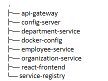

# docker-config
All necessary images are posted on https://hub.docker.com/repositories/jgier47 
To run the application all you need to do is to navigate to pulled repository docker-config directory inside the command line and type 
docker compose up

Everything else will be done automatically
Please find the project structure below:

  

1) api-gateway: https://github.com/Jgier47/api-gateway
2) config-server: https://github.com/Jgier47/config-server
3) department-service: https://github.com/Jgier47/department-service
4) docker-config: current repo -> https://github.com/Jgier47/docker-config
5) employee-service: https://github.com/Jgier47/employee-service 
6) organization-service: https://github.com/Jgier47/organization-service
7) react-frontend: https://github.com/Jgier47/employee-frontend
8) service-registry: https://github.com/Jgier47/service-registry
